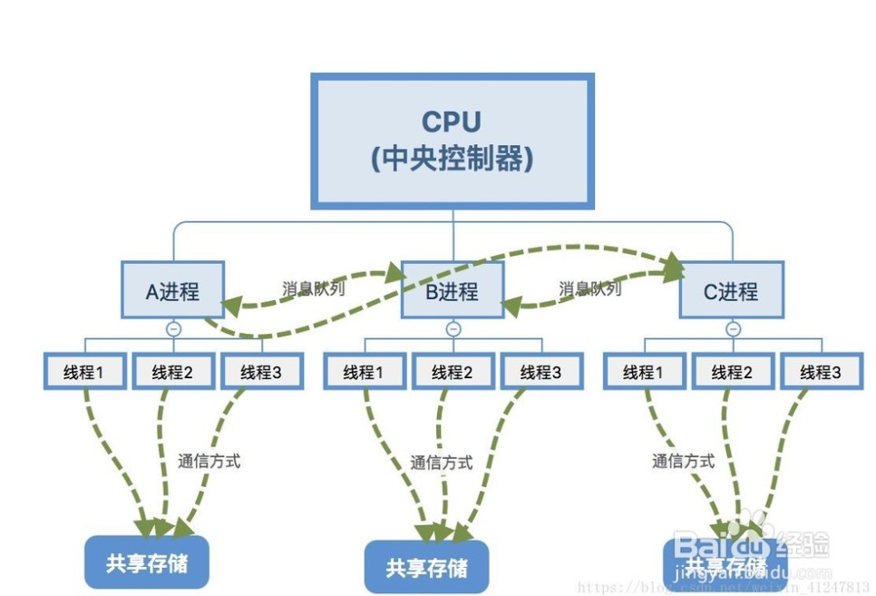
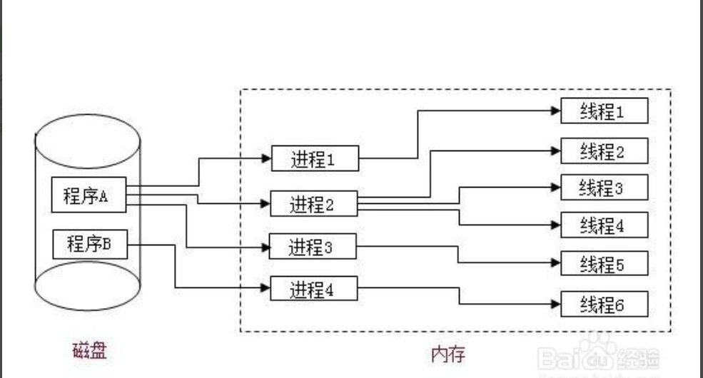
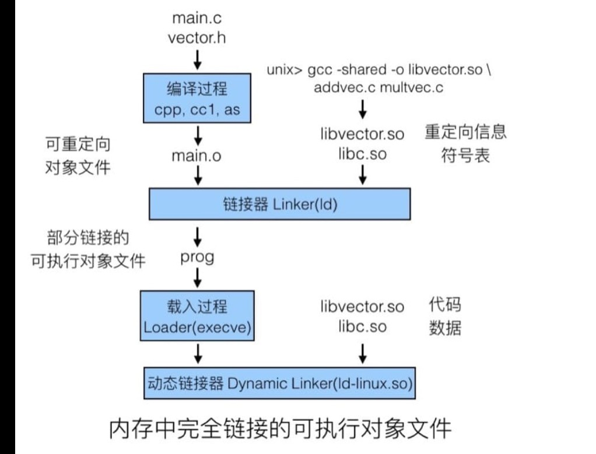

# 进程与线程

## 进程的常见状态

1. 就绪：进程已处于准备好运行的状态，即进程已分配到除CPU外的所有必要资源后。只要再获得CPU，便可立即执行。
2. 执行：进程已经获得CPU，程序正在执行状态。
3. 阻塞：正在执行的进程由于发生某事件暂时无法继续执行的状态。

## 进程与线程之间的区别

### 根本区别

1. 进程是资源分配的最小单位，线程是程序执行的最小单位。
2. 计算机在执行程序时，会为程序创建相应的进程，进行资源分配时，是以进程为单位进行相应的分配。每个进程都有相应的线程，在执行程序时，实际上是执行相应的一系列线程。

* 进程与线程之间的关系

### 地址空间

1. 进程有自己独立的地址空间，每启动一个进程，系统都会为其分配地址空间，建立数据表来维护代码段，堆栈段和数据段；
2. 线程没有独立的地址空间，统一进程的线程共享本进程的地址空间。

### 资源拥有

* 进程之间的资源是独立的；同一进程内的线程共享本进程的资源。

### 执行过程

1. 线程不能独立执行，必须依存在应用程序中。
2. 每个独立的进程有一个程序运行的入口、顺序执行序列的程序入口。

* 执行过程

### 基本单位

1. 线程是处理机调度的基本单位，但是进程不是。
2. 程序执行的过程其实是执行具体的线程，那么处理的也是程序相应的线程，所以处理机调度的基本单位是线程。

### 系统开销

1. 进程执行开销大，线程执行开销小。

### 线程中存不存在堆栈

线程中必须拥有私有栈，也可以拥有私有堆，

### 线程与协程之间的主要区别

协程，是一种更加轻量级的存在，协程不是被操作系统内核管理。而是完全由程序控制的（也就是在用户态执行），这样带来的好处就是性能得到了极大的提升，不会像线程切换那样消耗资源。

## 内存池，线程池，进程池

**线程池：**线程池的原理很简单，类似于操作系统中的缓冲区的概念，它的流程如下：先启动若干数量的线程，并让这些线程都处于睡眠状态，当需要一个开辟一个线程去做具体的工作时，就会唤醒线程池中的某一个睡眠线程，让它去做具体工作，当工作完成后，线程又处于睡眠状态，而不是将线程销毁。

**进程池**与线程池同理。

**内存池：**内存池是指程序预先从操作系统申请一块足够大内存，此后，当程序中需要申请内存的时候，不是直接向操作系统申请，而是直接从内存池中获取；同理，当程序释放内存的时候，并不真正将内存返回给操作系统，而是返回内存池。当程序退出(或者特定时间)时，内存池才将之前申请的内存真正释放。

## 动态链接库和静态链接库的区别

**静态库**是一个外部函数与变量的集合体。静态库的文件内容，通常包含一堆程序员的自定的变量与函数，其内容不像动态链接库那么复杂，在编译期间由编译器与链接器将它集成至应用程序内，并制作成目标文件以及可以独立运作的可执行文件。而这个可执行文件预编译可执行文件的程序，都是一种程序的静态创建。

* 静态库

**动态库**虽然静态库很方便，但是如果我们只是想用库中的某一个函数，却仍然把所有的内容都链接进去。一个更现代的方法则是使用共享库，避免了在文件中静态库的大量重复。动态链接可以在首次载入的时候执行（load-time linking），这是Linux的标准做法，会由动态链接器完成。
链接使得我们可以用多个对象文件构造我们的程序。可以在程序的不同阶段进行（编译、载入、运行期间均可）

* 动态库

### 两者之间的区别

1. 使用静态库的时候，静态链接库要参与编译，在生成执行文件之前的链接过程中，要将静态链接库的全部指令直接链入可执行文件中。而动态库提供了一种方法，*使进程可以调用不属于其可执行代码的函数。函数的可执行代码位于一个.dll文件中，该dll包含一个或多个已被编译，链接并与使用他们的进程分开储存的函数*。
2. 静态库中不能再包含其他动态库或静态库，而在动态库中还可以再包含其他动态或者静态库。
3. 静态库在编译的时候，就将库函数装载到程序中去了，而动态库函数必须在运行的时候才被装载，所以使用静态库速度快一些。

### 用户态切换到内核态的方式

1. 系统调用
2. 异常
3. 外围设备的中断

### 用户态和内核态之间的区别是什么

1. 权限不一样。
2. 用户态的进程能存取他们自己的指令和数据，但不能存取内核指令和数据。
3. 核心态下的进程能够存取内核和用户地址，某些机器指令是特权指令，在用户态下执行特权指令会引起错误。在系统中内推并不是作为一个与用户进程平行的估计的进程的集合。

### C++多线程，互斥，同步

* 同步和互斥
当有多个线程的时候，经常需要去同步(注：同步不是同时刻)这些线程以访问同一个数据或资源。例如，假设有一个程序，其中一个线程用于把文件读到内存，而另一个线程用于统计文件中的字符数。当然，在把整个文件调入内存之前，统计它的计数是没有意义的。但是，由于每个操作都有自己的线程，操作系统会把两个线程当作是互不相干的任务分别执行，这样就可能在没有把整个文件装入内存时统计字数。为解决此问题，你必须使两个线程同步工作。
  * 同步，是指在不同进程之间的若干程序片断，它们的运行必须严格按照规定的某种先后次序来运行，这种先后次序依赖于要完成的特定的任务。如果用对资源的访问来定义的话，同步是指在互斥的基础上（大多数情况），通过其它机制实现访问者对资源的有序访问。在大多数情况下，同步已经实现了互斥，特别是所有写入资源的情况必定是互斥的。少数情况是指可以允许多个访问者同时访问资源。
  * 互斥，是指散布在不同进程之间的若干程序片段，当某个进程运行其中一个程序片段时，其它进程就不能运行它们之中的任一程序片段，只能等到该进程运行完这个程序片段后才可以运行。如果用对资源的访问来定义的话，互斥某一资源同时只允许一个访问者对其进行访问，具有唯一性和排它性。但互斥无法限制访问者对资源的访问顺序，即访问是无序的。

* 多线程同步和互斥有几种实现方法 线程间的同步方法大体可分为两类：用户模式和内核模式。顾名思义，内核模式就是指利用系统内核对象的单一性来进行同步，使用时需要切换内核态与用户态，而用户模式就是不需要切换到内核态，只在用户态完成操作。

  * 用户模式下的方法有：原子操作（例如一个单一的全局变量），临界区。
  * 内核模式下的方法有：事件，信号量，互斥量。

1. 临界区:通过对多线程的串行化来访问公共资源或一段代码，速度快，适合控制数据访问。
2. 互斥量:为协调共同对一个共享资源的单独访问而设计的。
3. 信号量:为控制一个具有有限数量用户资源而设计。
4. 事 件:用来通知线程有一些事件已发生，从而启动后继任务的开始。

## 逻辑地址Vs物理地址Vs虚拟地址

* 逻辑地址，是指计算机用户(例如程序开发者)，看到的地址。例如，当创建一个长度为100的整型数组时，操作系统返回一个逻辑上的连续空间：指针指向数组第一个元素的内存地址。由于整型元素的大小为4个字节，故第二个元素的地址时起始地址加4，以此类推。事实上，逻辑地址并不一定是元素存储的真实地址，即数组元素的物理地址(在内存条中所处的位置)，并非是连续的，只是操作系统通过地址映射，将逻辑地址映射成连续的，这样更符合人们的直观思维。

* 虚拟内存。操作系统读写内存的速度可以比读写磁盘的速度快几个量级。但是，内存价格也相对较高，不能大规模扩展。于是，操作系统可以通过将部分不太常用的数据移出内存，“存放到价格相对较低的磁盘缓存，以实现内存扩展。操作系统还可以通过算法预测哪部分存储到磁盘缓存的数据需要进行读写，提前把这部分数据读回内存。虚拟内存空间相对磁盘而言要小很多，因此，即使搜索虚拟内存空间也比直接搜索磁盘要快。唯一慢于磁盘的可能是，内存、虚拟内存中都没有所需要的数据，最终还需要从硬盘中直接读取。这就是为什么内存和虚拟内存中需要存储会被重复读写的数据，否则就失去了缓存的意义。现代计算机中有一个专门的转译缓冲区(Translation Lookaside Buffer，TLB)，用来实现虚拟地址到物理地址的快速转换。

## 同步与异步

* 同步
  * 同步的定义：是指一个进程在执行某个请求的时候，若该请求需要一段时间才能返回信息，那么，这个进程将会一直等待下去，直到收到返回信息才继续执行下去。
  * 特点：同步是阻塞模式；
    同步是按顺序执行，执行完一个再执行下一个，需要等待，协调运行；
* 异步
  * 定义是指进程不需要一直等下去，而是继续执行下面的操作，不管其他进程的状态。当有消息返回时系统会通知进程进行处理，这样可以提高执行的效率。
  * 特点：异步是非阻塞模式，无需等待；
    异步是彼此独立，在等待某事件的过程中，继续做自己的事，不需要等待这一事件完成后再工作。线程是异步实现的一个方式。

**同步与异步的优缺点**：同步与异步的优缺点：
同步可以避免出现死锁，读脏数据的发生。一般共享某一资源的时候，如果每个人都有修改权限，同时修改一个文件，有可能使一个读取另一个人已经删除了内容，就会出错，同步就不会出错。但，同步需要等待资源访问结束，浪费时间，效率低。
异步可以提高效率，但，安全性较低。

## 守护、僵尸、孤儿进程的概念

守护进程：运行在后台的一种特殊进程，独立于控制终端并周期性地执行某些任务。

僵尸进程：一个进程 fork 子进程，子进程退出，而父进程没有wait/waitpid子进程，那么子进程的进程描述符仍保存在系统中，这样的进程称为僵尸进程。

孤儿进程：一个父进程退出，而它的一个或多个子进程还在运行，这些子进程称为孤儿进程。（孤儿进程将由 init 进程收养并对它们完成状态收集工作）

## IO多路复用

IO多路复用是指内核一旦发现进程指定的一个或者多个IO条件准备读取，它就通知该进程。IO多路复用适用如下场合：

当客户处理多个描述字时（一般是交互式输入和网络套接口），必须使用I/O复用。

当一个客户同时处理多个套接口时，而这种情况是可能的，但很少出现。

如果一个TCP服务器既要处理监听套接口，又要处理已连接套接口，一般也要用到I/O复用。

如果一个服务器即要处理TCP，又要处理UDP，一般要使用I/O复用。

如果一个服务器要处理多个服务或多个协议，一般要使用I/O复用。

与多进程和多线程技术相比，I/O多路复用技术的最大优势是系统开销小，系统不必创建进程/线程，也不必维护这些进程/线程，从而大大减小了系统的开销。

## 线程安全

如果你的代码所在的进程中有多个线程在同时运行，而这些线程可能会同时运行这段代码。如果每次运行结果和单线程运行的结果是一样的，而且其他的变量的值也和预期的是一样的，就是线程安全的。或者说:一个类或者程序所提供的接口对于线程来说是原子操作或者多个线程之间的切换不会导致该接口的执行结果存在二义性,也就是说我们不用考虑同步的问题。

线程安全问题都是由全局变量及静态变量引起的。
若每个线程中对全局变量、静态变量只有读操作，而无写操作，一般来说，这个全局变量是线程安全的；若有多个线程同时执行写操作，一般都需要考虑线程同步，否则的话就可能影响线程安全。

## 产生死锁的四个必要条件

1. 互斥条件：一个资源每次只能被一个进程使用。
2. 占有且等待：一个进程因请求资源而阻塞时，对已获得的资源保持不放。
3. 不可强行占有:进程已获得的资源，在末使用完之前，不能强行剥夺。
4. 循环等待条件:若干进程之间形成一种头尾相接的循环等待资源关系。

## 处理死锁的思路

1. **预防死锁** 破坏四个必要条件
2. **避免死锁** 在资源动态分配的过程中，用某种方式防止系统进入不安全的状态。
3. **检测死锁** 运行时产生死锁，及时发现思索，将程序解脱出来。
4. **解除死锁** 发生死锁后，撤销进程，回收资源，分配给正在阻塞状态的进程。

## 线程共享资源和独占资源问题

一个进程中的所有线程共享该进程的地址空间，但它们有各自独立的（私有的）栈(stack)，Windows线程的缺省堆栈大小为1M。堆(heap)的分配与栈有所不同，一般是一个进程有一个C运行时堆，这个堆为本进程中所有线程共享，windows进程还有所谓进程默认堆，用户也可以创建自己的堆。
用操作系统术语，线程切换的时候实际上切换的是一个可以称之为线程控制块的结构（TCB）,里面保存所有将来用于恢复线程环境必须的信息，包括所有必须保存的寄存器集，线程的状态等。

* 堆　是大家共有的空间，分全局堆和局部堆。全局堆就是所有没有分配的空间，局部堆就是用户分配的空间。堆在操作系统对进程初始化的时候分配，运行过程中也可以向系统要额外的堆，但是记得用完了要还给操作系统，要不然就是内存泄漏。

* 栈  是个线程独有的，保存其运行状态和局部自动变量的。栈在线程开始的时候初始化，每个线程的栈互相独立，因此，栈是　thread safe的。操作系统在切换线程的时候会自动的切换栈，就是切换　ＳＳ／ＥＳＰ寄存器。栈空间不需要在高级语言里面显式的分配和释放。

## 进程间的通信方式

* 管道
    * 有名管道 可以实现任意的两个进程之间的通信
    * 无名管道 简单方便，但是限于存在亲缘关系的进程之间的通信
* 信号量(同步进程)
* 消息队列:消息的链表存放在内核中并由消息队列标识符标识，消息队列克服了信号传递信息少，管道只能承载无格式字节流以及缓冲区大小受限等特点，消息队列是UNITX下不同进程之间可实现共享资源的一种机制，UNIX允许不同进程将格式化的数据流以消息队列形式发送给任意进程，对消息队列具有操作权限的进程都可以使用msget完成对消息队列的操作控制，通过使用消息类型，进程可以按任何顺序读信息，或为信息安排优先级顺序。
* 共享内存 映射一段能被其他进程所访问的内存，这段共享内存由一个进程创建，但多个进程都可以访问，**共享内存是最快的IPC（进程间通信）方式**
* 套接字

## 线程间的通信方式

1. 互斥锁（防止数据结构被并发修改的方法）
2. 读写锁（允许多个线程同时读取数据，但对写数据互斥）
3. 条件变量
4. 原子操作