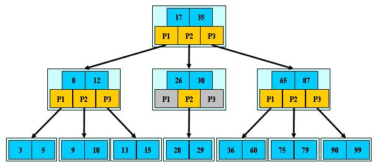
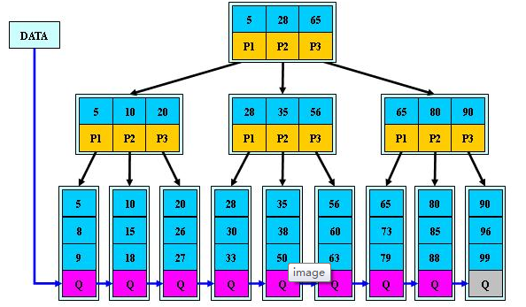
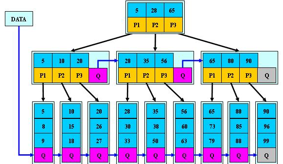

# B树和B-树介绍

B树即是二叉搜索树

1. 所有非叶节点至多有两个子节点
2. 每个节点只能存储一个关键字
3. 左节点<根<右节点

## B树的搜索

从根节点开始，如果查询关键字小于节点关键字，进入左儿子；
如果查询关键字大于节点关键字，进入右儿子；
如果查询关键字等于节点关键字,查询到节点；
如果节点左子树为空，右字数为空，且节点关键字不等于查询关键字，返回false，没有找到。

1. B树的左右子树如果平衡的话，搜索性能相当于二叉搜索
2. 如果B树只有左子树或者右子树，那样时间复杂度为O(n)

## B-树

B-树为多路搜索树

1. 定义任意非叶子节点最多只有M个儿子；且M>2
2. 根节点的儿子数为[2,M];
3. 除根结点以外的非叶节点的儿子数为[M/2,M];
4. 每个节点存放至少`M/2-1`（取上整）和至多M-1个关键字；(至少2个关键字)
5. 非叶节点的关键字个数=指向儿子的指针个数-1；
6. 非叶节点的关键字；K[i],K[2],...,K[M-1];且`K[i]<K[i+1]`
7. 非叶子节点的指针：P[1]、P[2]、、、P[M]，其中P[1]指向关键字小于K[1]的子树，P[M]指向关键字大于K[M-1]的子树，其他P[i]指向关键字属于(K[i-1],K[i])的子树；
8. 所有叶子节点未予同一层

B-树的特性：

1. 关键字集合分布在整棵树中
2. 任何一个关键字出现却只出现在一个节点中
3. 搜索有可能在非叶子节点中结束
4. 其搜索性能等价于在关键字全集内做一次二分查找
5. 自动层次控制

## B+树

B+树是B-树的变体，也是一种多路搜索树

1. 非叶子节点的子树指针与关键字个数相同
2. 非叶子节点的子树指针P[i]，指向关键字属于[K[i],K[i+1])的子树(`B-树`是开区间)
3. 为所有叶子节点增加一个链指针
4. 所有关键字都在叶子节点出现

B+树的搜索相似B-树但是只能在叶节点中命中。

### B+树的分裂

当一个节点满时，分配一个新的节点，并将原节点`1/2`的数据保存到新的接点中，最后在父结点中增加新节点的指针，B+树的分裂只影响原节点和父节点，并不影响兄弟节点。

## B*树

B+树的变体，只是在**B+树的非根非叶节点上增加兄弟节点**

### B*树的分裂

如果原节点满时，将数据移一部分到下一个兄弟节点中，再在原节点插入关键字，修改父节点中兄弟节点的关键字，如果兄弟也满了，则在原节点与兄弟节点之间新建一个节点，并各复制1/3的数据到新结点中，最后在父节点中增加新节点的指针。

### B*树比B+树分配新节点概率更低，空间利用率更高

