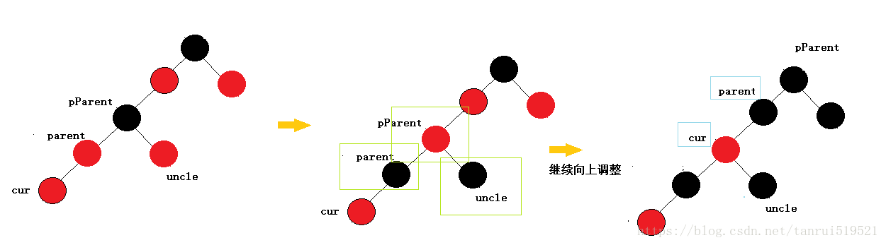
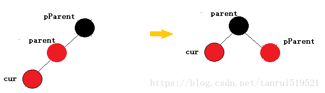
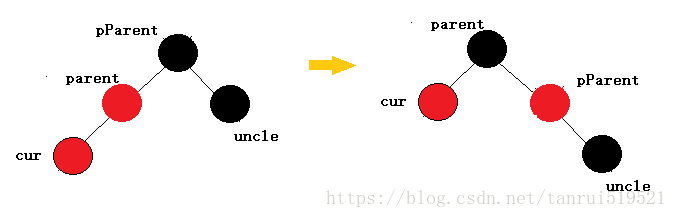
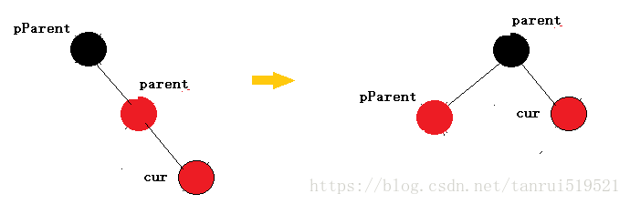
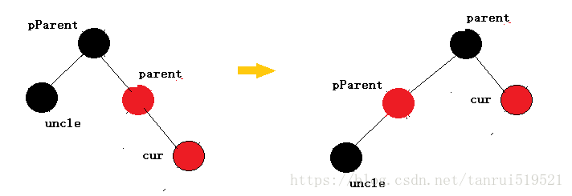
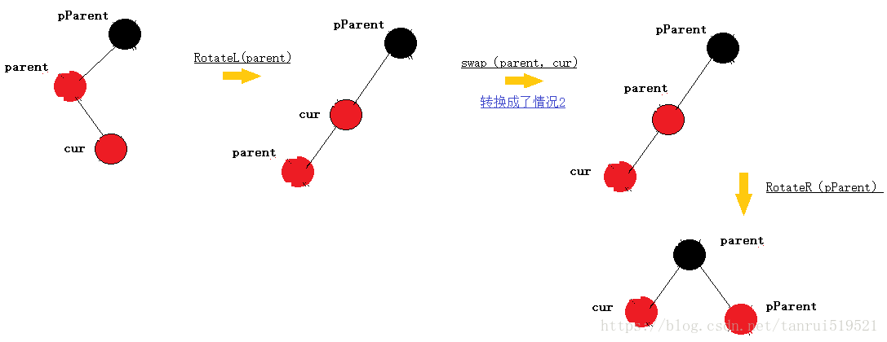
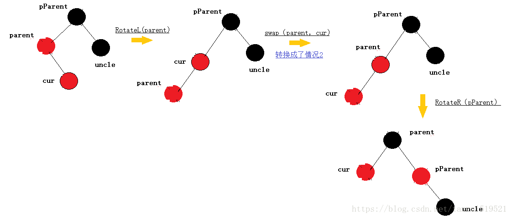
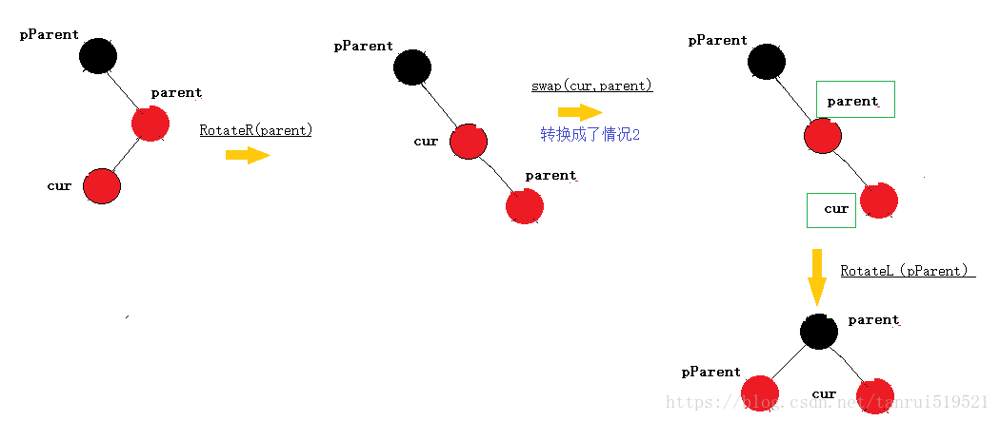
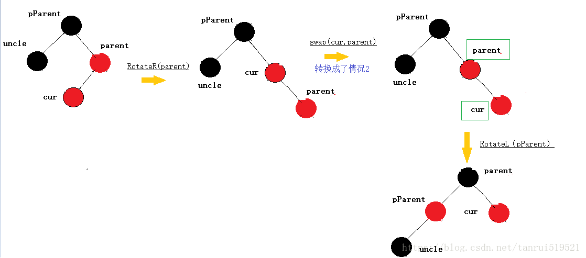

# 浅谈红黑树

## 红黑树于AVL树之间的比较

1. `AVL`树的时间复杂度优于红黑树。
2. 红黑树的插入操作比`AVL`树更便于控制操作
3. 红黑树整体性能略优于`AVL`树

## 红黑树的性质

红黑树本质上是一棵二叉搜索树，每个节点都有一个存储位记录节点的颜色，可以是`RED`，也可以是`BLACK`；通过任意一条从根到叶子简单路径上颜色的约束，红黑树保证最长路径不超过最短路径的二倍，因而近似平衡。

性质如下

1. 每个节点颜色不是黑色，就是红色
2. **根节点**是黑色的
3. 如果一个节点是红色，那么它的两个子节点就是黑色的（没有连续的红节点）
4. 对于每个节点，从该节点到其后代叶节点的简单路径上，均包含相同数目的黑色节点。

最短路径是全黑节点，最长路径就是一个红节点和黑节点，最后节点相同时，最长路径刚好是最短路径的两倍。

## 红黑树的插入

红黑树插入节点过程大致分析

1. RB-Tree为二叉搜索树，我们按照二叉搜索树的方法对其进行
节点插入
2. RB-Tree有颜色约束性质，因此在插入新节点之后要进行颜色调整

具体步骤

1. 根节点为NULL，直接插入新节点并将其颜色置为黑色
2. 根节点不为NULL，找到要插入新节点的位置
3. 插入新节点
4. 判断新插入节点对全树颜色的影响，更新调整颜色

红黑树插入节点时默认颜色为红色

如果插入节点父节点为黑，那么直接插入后返回不需要做任何调整，但是如果插入节点的父亲节点为红，则需要进行调整

1. 第一种情况
`cur`为红，`parent`为红，`pParent`为黑，`uncle`存在且为红,则将`parent`，`uncle`改为黑，`pParent`改为红,然后把`pParent`当成`cur`，继续向上调整

2. 第二种情况
`cur`为红，`parent`为红，`pParent`为黑，`uncle`不存在或者为黑节点，`parent`为`pParent`的左孩子，`cur`为`parent`的左孩子，则进行右单旋转。

**`uncle`不存在**

**`uncle`存在且为黑**

**相反，parent为pParent的右孩子，cur为parent的右孩子，则进行左单旋转；p，g变色-p变黑，g变红**
**uncle不存在**

**uncle存在**

3. 第三种情况
`cur`为红，`parent`为红，`pParent`为黑，`uncle`不存在或者`uncle`为黑，`parent`为`pParent`的左孩子，`cur`为p的右孩子，则针对p做左单旋转则转换成了情况2

**`uncle`不存在**

**`uncle`存在且为黑**

**相反情况，parent为pParent的右孩子且cur为parent的左孩子且`uncle`不存在，以parent做左旋转**

**`uncle`存在**

