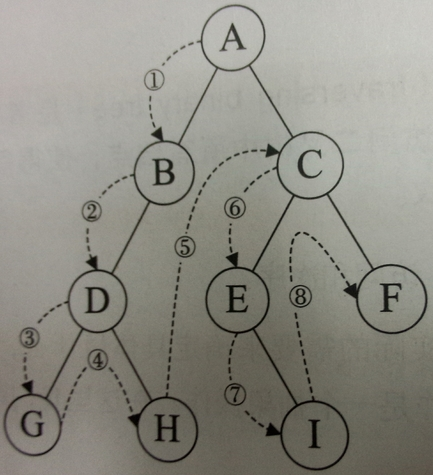

# 二叉树

二叉树的一些特征：
$$
n=n_1+n_2+n_0
$$
总节点的节点的度数之和加一
$$
n=n_1+2n_2+1
$$
然后两个可以推导出来这个公式
$$
n_2=n_0-1
$$

二叉树经常用到的四种遍历形式

## 先序遍历（前序遍历）

逻辑很简单，根->左节点->右节点

注意：每次访问下一棵子树的时候都是这种顺序，先根再左然后右。下面有图片解释



代码（这里的vist函数是泛称，指对当前根的一个操作函数，可以输出，可以计算）

```C++
    void PreOrder(TreeNode *root){
        if(root!=NULL){
            vist(root);//访问根节点
            PreOrder(root->left);//遍历左子树
            PreOrder(root->right);//遍历右子树
        }
    }
```

非递归版的前序遍历

```C++

void PreOrder(TreeNode* head){
    if(!head)return;
    stack<TreeNode*> stk;
    auto p=head;
    while(p!=nullptr||!stk.empty()){
        while(p!=nullptr){
            //对当前的节点操作
            //比如输出当前节点
            cout<<p->val;
            stk.push(p);
            p=p->left;
        }
        if(stk.size()){
            p=stk.pop();
            s.pop();
            p=p->right;
        }
    }
}

```

## 中序遍历

```md
**前序和中序遍历可以唯一的确定一颗二叉树**

前序和后序遍历不可以唯一确定一棵二叉树

前序和中序遍历不可以唯一确定一棵二叉树

```

逻辑：左子树->根->右子树

特点：中序遍历的第一个节点是最左边的节点（跟深度无关）最左边的节点。

可以结合前序遍历，前序找根，中序中在跟的左边为根的左子树，右边为右子树，然后接着丛前序中找左子树的根节点，对应中序中找出左右子树，这样就可以唯一的确定一颗二叉树。

代码

```C++
    void InOrder(TreeNode* root){
        if(root!=NULL){
            InOrder(root->left);
            vist(root);
            InOrder(root->right);
        }
    }
```

非递归般的中序遍历

```C++
    void InOrder(TreeNode* root){
        if(!root)return;
        auto p=root;
        stack<int> stk;
        while(p||stk.size()){
            while(p){
                stk.push(p);
                p=p->lchild;
            }
            if(stk.size()){
                p=stk.top();
                stk.pop();
                //对当前的节点进行操作
                cout<<p->val;
            }
        }
    }
```

## 后序遍历

逻辑：左子树->右子树->根

```C++
    void LastOrder(TreeNode* t){
        if(t!=NULL){
            LastOrder(t->left);
            LastOrder(t->right);
            vist(t);
        }
    }
```

非递归的代码

```C++
    void postOrder(TreeNode* head){
        if(!head)return;
        stack<TreeNode*> stk;
        stk.push(head);
        TreeNode* pre=nullptr;
        while(stk.size()){
            auto cur=stk.top();
            if((!cur->left&&!cur->right)||
            ((pre==cur->left||pre==cur->right)&&pre)){
                cout<<cur->val;//处理当前节点
                s.pop();
                pre=cur;
            }else{
                if(cur->right)stk.push(cur->right);
                if(cur->left)stk.push(cur->left);
            }
        }
    }
```

常见的题型：给出前序和后序，那颗是不可能的树

## 层序遍历

逻辑：从上到下，从左到右，通常需要一个队列来辅助算法实现

```C++
    void LayerOrder(TreeNode* root){
        list<TreeNOde*> tem;
        if(root!=NULL){
            tem.push_back(root);
        }
        while(!tem.empty()){
            TreeNode* temp=tem.pop_front();
            //如果当前节点的左孩子节点不为空存入容器中
            if(temp->left!=NULL){
                tem.push_back(temp->left);
            }
            //如果当前节点的右孩子节点不为空存入容器中
            if(temp->right!=NULL){
                    tem.push_back(temp->left);
            }
            //对当前的节点进行操作
            vist(temp);
        }
    }
```

## 几种值得记忆二叉树的操作方法

计算二叉树的高度
递归版的

```C++
    int GetHight(TreeNode* root){
        if(root!=NULL)
            return max(GetHight(root->left),GetHight(root->right))+1;
    } 
```

寻找当前节点的父亲节点

```C++
    TreeNode* GetFatherNode(TreeNode* root,TreeNode* t){
        if(root!=NULL){
            if(root->left==t||root->right==t){
                return root;
            }
            GetFatherNode(root->left,t);
            GetFatherNode(root->right,t);
        }
    }
```
