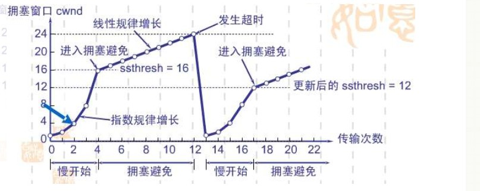
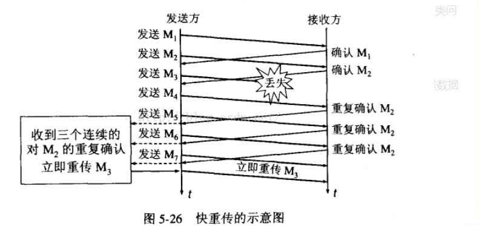
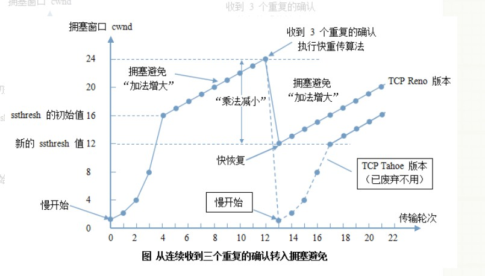

# 详解TCP协议

**特点**：

1. 提供面向可靠的连接
2. 为上层应用层提供服务，不关心具体传输的内容是什么，不知道二进制流与ASCII码

## 建立连接与销毁连接

### 三次握手建立连接

所谓的三次握手建立连接是指建立一个tcp连接时，需要客户端和服务器端总共发送三个包

三次握手的目的是连接服务器和指定端口，建立tcp连接，并同步连接**双方的序列号和确认号**，交换tcp窗口大小信息。在socket编程中，客户端执行`connect()`时，触发三次握手

1. 第一次握手(SYN=1,seq=x)
    客户端发送一个TCP的SYN标志位置1的包，指明客户端打算连接的服务器的端口，以及初始序号X，保存在包头的序列号（Sequence Number）字段里

    发送完毕后，客户端进入`SYN_SEND`状态。
2. 第二次握手（SYN=1，ACK=1，Seq=y，ACKnum=x+1;）
    服务器发会确认包（ACK）应答。即SYN标志位和ACK标志位均为1。服务器端选择自己的`ISN`序列号，放到Seq域里，同时确认ACKnum序号设置为客户端的ISN加1，即x+1。

    发送完毕后，服务器进入`SYN_RCVD`状态。
3. 第三次握手（ACK=1，ACKnum=y+1）
    客户端再次发送确认包（ACK），SYN标志位为0，ACK标志位为1，并且把服务器发来ACK的序号字段+1，放在确定字段中发送给对方，并且在数据段放写ISN的+1

    发送完毕后，客户端进入`ESTABLEISHED`状态，当服务器端接收到这个包时，也进入`ESTABLEISHED`状态，TCP握手结束。

三次握手的示意图

### 四次挥手断开连接

TCP四次挥手是指服务端和客户端共同发送了四个包来断开连接，在`socket`编程中，任何一方调用`close()`即可产生四次挥手
TCP的连接是全双工的，数据在两个方向上同时传输，（TCP支持半关闭，发送一方结束还能接收数据）

前提客户端想要关闭TCP连接

1. 第一次挥手(FIN=1，seq=x)
    客户端向服务端发送FIN标志位置为1的包，表示自己已经没有数据可以发送了，但是仍然可以接送数据。

    发送完毕后，客户端进入`FIN_WAIT_1`状态
2. 第二次挥手(ACKnum=x+1,ACK=1)
    服务器端接收到客户端发送的FIN包后，发送一个确认包（ACK），表明自己已经知道了客户端关闭连接的请求，但是自己还没有准备好。

    发送完毕后，服务器端进入`CLOSE_WAIT`状态
    客户端接收到包后，进入到`FIN_WAIT_2`状态
3. 第三次挥手(FIN=1,seq=y)
    服务器端向客户端发送FIN标志为1的包，表示自己已经准备断开连接。

    发送完毕后，服务器端进入`LAST_ACK`的状态
4. 第四次挥手(ACK=y+1)
    客户端接收到包后，发送一个确认包到服务器ACK标志位为1，ACKnum为y+1.

    发送完毕后，客户端进入`TIME_WAIT`的状态

    服务器接收到包后，进入`CLOSED`状态

客户端等待一段固定时间（**2MSL** 2 Maximum Segment Lifetime）没有收到服务器的ACK包，确认服务器已经正常断开连接，于是自己也关闭连接，进入到`CLOSED`状态，

四次挥手示意图

## 拥塞控制

概念：防止过多的数据注入到网络当中，这样可以使网络中的路由器或链路不致过载。（通过拥塞窗口处理网络拥塞现象的一种机制）

### 拥塞控制的几种方法

慢开始 拥塞避免 快重传 快恢复

#### 慢开始

算法原理：先由小到大逐渐增大发送窗口，换句话说，由小到大逐渐增大拥塞窗口数值。通常在刚刚发送报文段时，先把拥塞窗口cwnd设置为一个最大报文段mss的数值。每收到一个新的报文段的确认后，把拥塞窗口增加至多一个mss的数值，用这样的方式逐渐增大发送方的拥塞窗口cwnd。

当cwnd足够大时，为了防止拥塞窗口cwnd增长引起网络阻塞，还需要另外一个变量----慢开始门限ssthresh

1. 当cwnd`<`ssthresh时，使用上述慢启动算法
2. 当cwnd`>`ssthresh时，停止使用慢启动算法，改用
拥塞避免算法

#### 拥塞避免

让拥塞窗口缓慢的增大，即每经过一个往返时间rtt就把发送方的拥塞窗口cwnd加1，而不是加倍，这样拥塞窗口cwnd按线性规律缓慢的增长，比慢开始算法的拥塞窗口增长速率缓慢的多

#### 快重传

接收方收到一个是虚的报文段后立刻发出重复确认，不用等待自己发送数据时进行捎带确认

#### 快恢复

1. 当发送方连续接收到三个重复确认时，执行"乘法减小"算法,慢启动门限减半，为了预防网络发生阻塞
2. 由于发送方现在认为网络很可能没有发生阻塞，因此现在不执行慢启动算法，而是执行拥塞避免算法把cwnd值线性增大

## 粘包和拆包

### 导致原因

1. 要发送的数据大于tcp发送缓冲区剩余空间大小
2. 待发送数据大于MSS（最大报文长度），TCP在传输前将进行拆包
3. 要发送的数据小于TCP发送缓冲区的大小，TCP将多次写入缓冲区的数据一次发送出去
4. 接受数据段的应用层没有及时读取接收缓冲区的数据

### 解决方法

1. 发送方给每个数据包添加包首部，首部中包含数据包的长度，接收端在接收到数据后，通过读取包首部的长度字段，便知道数据包的长度。
2. 发送端将每个数据包封装为固定长度（不够的可以通过补0填充）
3. 可以在数据包之间设置边界，如添加特殊符号。

